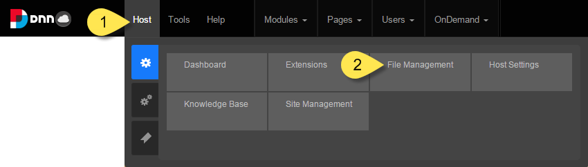
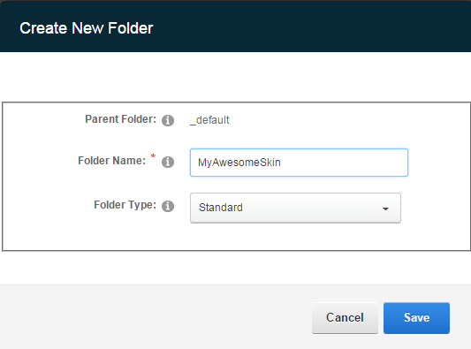
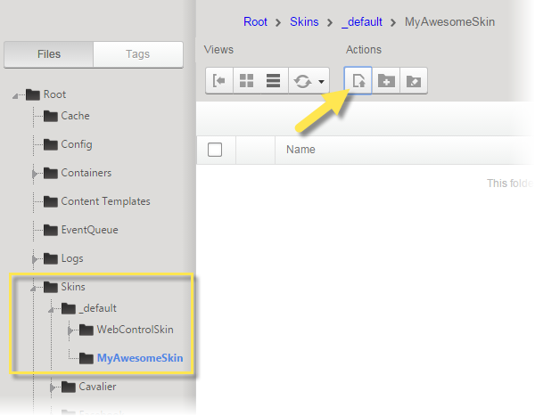

===============================================
|InReview| Uploading Themes to Your DNN Website
===============================================

Prerequisites
==================
.. include:: ../common/bptext/BP-PrereqHost.html

Steps
==================

#. While logged in as a host, go to **Host** > **File Management**. |filemanagement|

#. In your DNN installation, create a new folder for your theme under **Skins\_default**. The new folder name becomes the name of the DNN theme.

   |skinfolder|
   
   |createfolder|

#. Upload these files to the new DNN theme folder:

   * layout templates for the site

   * CSS files for the site (These must be in the same folder as the associated layout templates.)

   * containers for modules
   
   |uploadtemplate|
   |uploadfiles| 
   

.. |skinfolder|     image:: ../common/img/scr-SkinsDefaultCreateFolder.png
                    :width: 55 %

.. |uploadfiles|    image:: ../common/img/scr-UploadFiles.png
                    :width: 75 %
