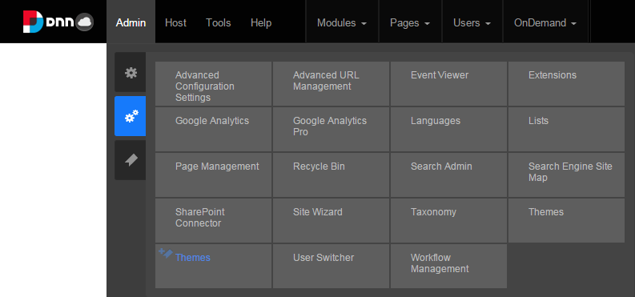
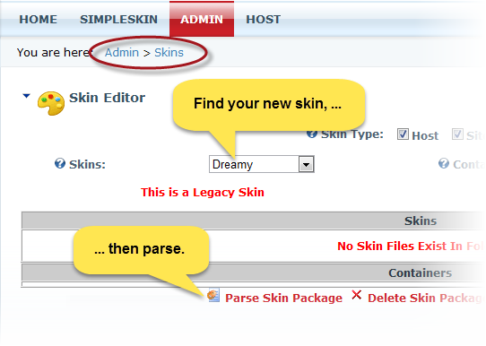

================================
|InProgress| Convert Themes
================================

Overview
====================

Although you can define your layout templates or containers in either HTML or ASCX, DNN uses ASCX internally. Therefore, if you create your layout templates or containers in HTML, you must convert them to ASCX before you package your theme.

The conversion simply:

* adds the **Control** line at the top of the file

* adds **Registry** lines for each token used within the file, and

* replaces the HTML tokens with ASCX tokens.

Prerequisites
====================

.. include:: ../common/bptext/BP-PrereqHost.html

Steps
====================

#. While logged in as an admin or host, go to **Admin** > **Themes**.
   
   |adminthemes|

#. Choose your new theme in the **Themes** dropdown, then click **Parse Theme Package**. 

   |selectthemes|        

.. note:: 
    
    The conversion only goes in one direction (from HTML to ASCX). To make changes to the layout template, you can:
    
    * make changes directly to the ASPX file, or
    * make the changes in your original HTML file and reconvert it to ASPX,   overriding any changes made directly to the ASPX file.
    
    

Example
====================
This HTML layout template:::

    

is converted to this ASCX layout template:::  

    <%@ Control language="vb" AutoEventWireup="false" Explicit="True" Inherits="DotNetNuke.UI.Skins.Skin">
    

                         
